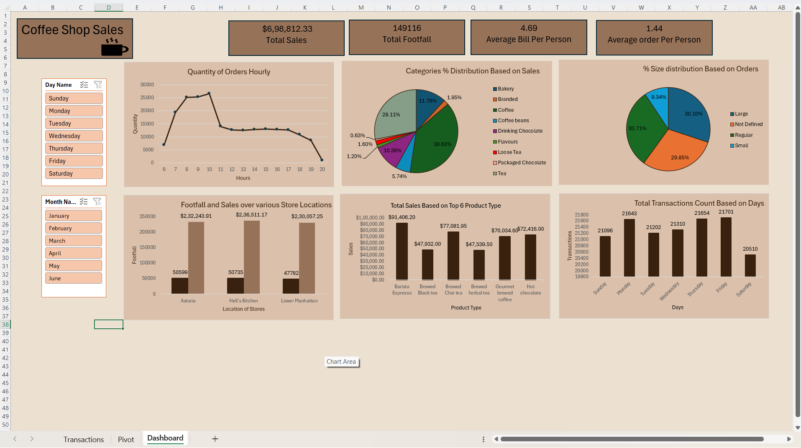

# Coffee Shop Sales Analysis ☕📊

## Project Overview
This project is an interactive Excel Dashboard that analyzes sales data for a coffee shop. It helps in understanding customer behavior and peak sales periods.

## Key Insights
- **Top Products:** Identified the best-selling coffee categories.
- **Peak Hours:** Found the busiest hours for better staff management.
- **Location Analysis:** Compared footfall across different store locations.

## Tools Used
- **Microsoft Excel:** Pivot Tables, Advanced Formulas, and Data Visualization.
- **Power Query:** For cleaning and transforming raw sales data.

## How to View
1. Download the `.xlsx` file from this repository.
2. Open in Microsoft Excel for the full interactive experience (Slicers & Filters).
